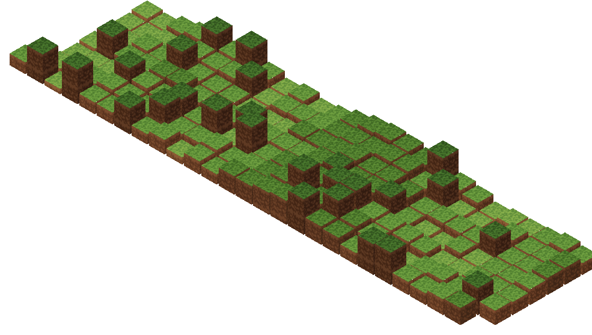

# github-profile-minecraft-readme

GitHub contribution data를 Minecraft-style `SVG` 잔디 월드로 렌더링하고, GitHub README에 바로 넣을 수 있는 자산으로 내보내는 전용 레포입니다.

## Preview



이 레포의 범위는 좁습니다.

- GitHub GraphQL에서 데이터 수집
- isometric 잔디 플랫폼 SVG 생성
- README-safe 결과물 생성

여기서는 범용 테마 시스템이나 다른 출력 포맷 호환을 유지하지 않습니다.

## Rendering Goal

GitHub README에서 바로 쓸 수 있는 산출물은 실행형 HTML이 아니라 정적인 이미지 자산입니다. 이 레포는 그 제약을 기준으로 바로 SVG를 생성합니다.

그래서 이 레포는 처음부터 다음 파이프라인만 남겼습니다.

`GitHub data -> SVG world -> README embed`

## Requirements

- Node.js 22+

## Install

```bash
npm install
```

## Local Preview

샘플 데이터로 바로 렌더링:

```bash
npm run render:sample
```

생성물:

- `profile/profile-minecraft.svg`
- `profile/README-snippet.md`

## Real GitHub Data

```bash
GITHUB_TOKEN=your_token npm run render -- --username your-github-id --output-dir profile
```

선택 옵션:

- `--config config/default.json`
- `--weeks 26`
- `--width 1280`
- `--height 420`
- `--background sky`
- `--background transparent`
- `--year 2026`
- `--max-repos 100`

## README Usage

렌더 후 `profile/README-snippet.md`가 생성됩니다.

기본 형태는 다음과 같습니다.

```md

```

## Config

기본 설정 파일은 [config/default.json](/Users/minseok128/Desktop/goinfre/github-profile-minecraft-readme/config/default.json) 입니다.

현재 주요 설정:

- `weeks`: 표시할 주 수
- `width`, `height`: SVG 레이아웃 목표 크기
- `background`: `sky` 또는 `transparent`
- `showHud`: 오버레이 정보 표시 여부
- `showSheep`: 향후 sheep 레이어 토글용 플래그

## GitHub Actions

예제 워크플로는 [.github/workflows/render-profile.yml](/Users/minseok128/Desktop/goinfre/github-profile-minecraft-readme/.github/workflows/render-profile.yml) 에 있습니다.

이 워크플로는:

- 스케줄 또는 수동 실행
- SVG 자산 재렌더링
- `profile/` 디렉터리 커밋 갱신

## Repo Layout

- [src/cli.ts](/Users/minseok128/Desktop/goinfre/github-profile-minecraft-readme/src/cli.ts): CLI entry
- [src/github/github-graphql.ts](/Users/minseok128/Desktop/goinfre/github-profile-minecraft-readme/src/github/github-graphql.ts): GitHub GraphQL fetch
- [src/github/aggregate-user-info.ts](/Users/minseok128/Desktop/goinfre/github-profile-minecraft-readme/src/github/aggregate-user-info.ts): fetched data -> scene snapshot
- [src/scene/build-scene-svg.ts](/Users/minseok128/Desktop/goinfre/github-profile-minecraft-readme/src/scene/build-scene-svg.ts): SVG world builder
- [src/render/exporter.ts](/Users/minseok128/Desktop/goinfre/github-profile-minecraft-readme/src/render/exporter.ts): SVG writer and README snippet exporter
