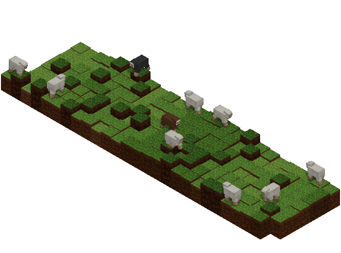

# github-profile-minecraft-readme

GitHub contribution data를 Minecraft-style Three.js 씬으로 렌더링하고, GitHub README에 바로 넣을 수 있는 `PNG`/`GIF` 자산으로 내보내는 전용 레포입니다.

## Preview



이 레포의 범위는 좁습니다.

- GitHub GraphQL에서 데이터 수집
- 잔디 블록 + 양이 있는 Three.js 씬 생성
- headless browser로 캡처
- README-safe 결과물 생성

여기서는 범용 테마 시스템이나 SVG 호환을 유지하지 않습니다.

## Rendering Goal

GitHub README는 `Three.js HTML` 자체를 직접 실행할 수 없습니다. 실사용 가능한 목표는 `HTML 생성`이 아니라 `정적/애니메이션 이미지 export`입니다.

그래서 이 레포는 처음부터 다음 파이프라인만 남겼습니다.

`GitHub data -> scene -> PNG/GIF -> README embed`

## Requirements

- Node.js 22+
- `ffmpeg`
- Chromium for Playwright

## Install

```bash
npm install
npx playwright install chromium
```

## Local Preview

샘플 데이터로 바로 렌더링:

```bash
npm run render:sample
```

생성물:

- `profile/profile-minecraft.png`
- `profile/profile-minecraft.gif`
- `profile/profile-minecraft.html`
- `profile/README-snippet.md`

## Real GitHub Data

```bash
GITHUB_TOKEN=your_token npm run render -- --username your-github-id --output-dir profile
```

선택 옵션:

- `--config config/default.json`
- `--weeks 53`
- `--width 1200`
- `--height 892`
- `--background sky`
- `--background transparent`
- `--no-gif`
- `--no-png`
- `--emit-html`
- `--max-repos 100`

## README Usage

렌더 후 `profile/README-snippet.md`가 생성됩니다.

기본 형태는 다음과 같습니다.

```md

```

GIF를 끄면 PNG를 대신 사용하면 됩니다.

## Config

기본 설정 파일은 [config/default.json](/Users/minseok128/Desktop/goinfre/github-profile-minecraft-readme/config/default.json) 입니다.

현재 주요 설정:

- `weeks`: 표시할 주 수
- `width`, `height`: 기본 출력은 `1200x892`
- `background`: 기본값은 `transparent`
- `showHud`: 기본값은 `false`
- `createPng`, `createGif`: 출력 형식
- `emitHtml`: standalone preview HTML 생성 여부
- `gif.durationSec`, `gif.fps`: GIF 길이와 프레임 수

## GitHub Actions

예제 워크플로는 [.github/workflows/render-profile.yml](/Users/minseok128/Desktop/goinfre/github-profile-minecraft-readme/.github/workflows/render-profile.yml) 에 있습니다.

이 워크플로는:

- 스케줄 또는 수동 실행
- 자산 재렌더링
- `profile/` 디렉터리 커밋 갱신

## Repo Layout

- [src/cli.ts](/Users/minseok128/Desktop/goinfre/github-profile-minecraft-readme/src/cli.ts): CLI entry
- [src/github/github-graphql.ts](/Users/minseok128/Desktop/goinfre/github-profile-minecraft-readme/src/github/github-graphql.ts): GitHub GraphQL fetch
- [src/github/aggregate-user-info.ts](/Users/minseok128/Desktop/goinfre/github-profile-minecraft-readme/src/github/aggregate-user-info.ts): fetched data -> scene snapshot
- [src/scene/build-scene-page.ts](/Users/minseok128/Desktop/goinfre/github-profile-minecraft-readme/src/scene/build-scene-page.ts): Three.js scene HTML builder
- [src/scene/sheep-planner.ts](/Users/minseok128/Desktop/goinfre/github-profile-minecraft-readme/src/scene/sheep-planner.ts): sheep spawn/path planner
- [src/render/exporter.ts](/Users/minseok128/Desktop/goinfre/github-profile-minecraft-readme/src/render/exporter.ts): Playwright capture + ffmpeg export
